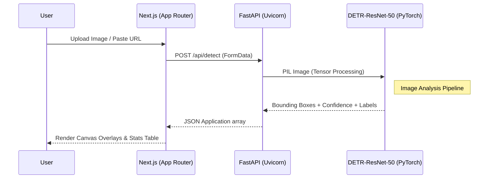

# VisualIntel — AI Object Detection

   

VisualIntel is a premium, cutting-edge AI web application built to perform high-speed object detection on unstructured image data. Upload any image (or provide a URL), and the system's deep learning pipeline will instantly identify and locate every recognizable object with pixel-accurate bounding boxes and confidence scores.

---

## 🏗️ System Architecture

VisualIntel uses a decoupled architecture with a high-performance Next.js interface communicating with a machine learning-focused FastAPI backend serving PyTorch.

### Component Breakdown
1. **Frontend (`/frontend`)**: Next.js full-stack application leveraging App Router. Built with React 19, Tailwind CSS v4, and Framer Motion for fluid, cybernetic micro-interactions.
2. **Backend (`/backend`)**: Python 3.10+ FastAPI server optimized for concurrent machine learning workloads. Uses `python-multipart` to handle binary streams.
3. **AI Core (`facebook/detr-resnet-50`)**: Uses the Hugging Face `transformers` port of Facebook's DEtection TRansformer algorithm.

---

## 🔍 Image Analysis Pipeline (DETR)

VisualIntel uses the **DETR (DEtection TRansformer)** model utilizing a **ResNet-50 backbone** for image feature extraction.

Unlike traditional object detection models (like older YOLO versions or Faster R-CNN) that rely heavily on complex anchor box generation or non-maximum suppression (NMS), DETR approaches object detection as a *direct set prediction problem*.

### How VisualIntel Analyzes Images:
1. **Convolutional Feature Extraction**: The uploaded image tensor passes through the ResNet-50 CNN to obtain a 2D representation of the image features.
2. **Transformer Encoding/Decoding**: The feature map is flattened and combined with positional encodings, passing through a standard Transformer architecture.
3. **Bipartite Matching Prediction**: The decoder output predicts objects simultaneously (up to 100 predictions by default). The model learns to output an empty "no object" slot if it lacks confidence.
4. **Thresholding Filtering**: The Python backend filters predictions dynamically based on the user-selected minimum confidence (e.g., `> 70%`).

