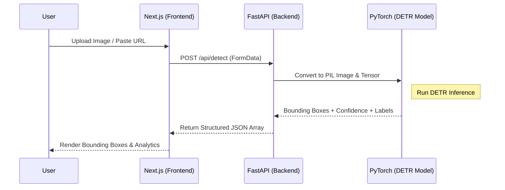

# VisualIntel — High-Speed AI Object Detection


> VisualIntel is a premium, cutting-edge web application engineered for high-speed, unstructured image data analysis. By combining a modern cyber-minimalist interface with a powerful deep learning backend, it provides near-instantaneous object detection and precise localization.

## 🚀 Key Features

* **Drag & Drop Interface:** Seamlessly upload images or paste direct URLs for immediate analysis.
* **Dynamic Thresholding:** Real-time adjustable confidence bounding filtering.
* **Cyber-Minimalist UI:** A premium dark-mode aesthetic featuring fluid, physics-based micro-interactions powered by Framer Motion.
* **Instant Bounding Boxes:** Pixel-accurate rendering of detected objects directly onto the image canvas.
* **Visual Analytics Chart:** Interactive data visualization of object distributions using Recharts.

## 🛠 Tech Stack

* **Frontend:** Next.js 15 (App Router), React 19, Tailwind CSS v4, Framer Motion, Recharts.
* **Backend:** Python 3.10+, FastAPI, Uvicorn, python-multipart.
* **Machine Learning:** PyTorch, Hugging Face `transformers` (DETR-ResNet-50), Pillow for tensor/image processing.

## 🏗 System Architecture & Pipeline

VisualIntel operates on a highly decoupled architecture, separating the volatile machine-learning operations from the lightning-fast client interface.



### Image Analysis Pipeline (DETR)
The core of VisualIntel utilizes the **DETR (DEtection TRansformer)** model. Traditional object detection algorithms rely heavily on complex anchor generation or non-maximum suppression. DETR entirely removes these heuristics, treating object detection as a direct set prediction problem.

1. **Convolutional Feature Extraction:** The input tensor is passed through a **ResNet-50 backbone**, distilling the image into a 2D spatial feature map.
2. **Transformer Encoding/Decoding:** This feature map is flattened, augmented with positional encodings, and processed through a standard Transformer encoder-decoder architecture.
3. **Bipartite Matching Prediction:** The model simultaneously predicts up to 100 object bounding boxes and their class probabilities in parallel.
4. **Threshold Filtering via Python Backend:** FastAPI dynamically culls low-confidence predictions based on the user's selected threshold parameter before dispatching data back to the client.

## 📸 Visual Previews

  


## 💻 Getting Started (Local Setup)

Follow these instructions to run the full-stack application securely on your local machine.

> **Prerequisites:** Please ensure you have **Node.js** and **Python 3.10+** installed on your system.

**Step 1: Clone the Repository**
```bash
git clone https://github.com/Victorralph7011/VisualIntel.git
cd VisualIntel
```

**Step 2: Backend Setup**
```bash
cd backend
python -m venv .venv

# Activate the virtual environment
source .venv/bin/activate  # macOS/Linux
# or `.\.venv\Scripts\activate` on Windows

pip install -r requirements.txt
uvicorn main:app --reload
```
> The FastAPI server will spin up on `http://localhost:8000`.

**Step 3: Frontend Setup**
```bash
# Open a new terminal instance
cd frontend
npm install
npm run dev
```
> The Next.js application will compile and become available at `http://localhost:3000`.

## 📡 API Reference

### `POST /api/detect`
The primary inference endpoint for the AI engine.

* **Accepts:** `multipart/form-data` containing an `image` binary file. Alternatively, accepts an `image_url` string parameter.
* **Returns:** A JSON array containing detected objects, their localized bounding box coordinates `[xmin, ymin, xmax, ymax]`, text labels, and confidence scores (0.0 to 1.0).

---

## 👨‍💻 Author

**Created by Shashwat Chaturvedi.**  
[LinkedIn Profile](https://www.linkedin.com/in/shashwat-chaturvedi-a840a4353/) | [GitHub Profile](https://github.com/Victorralph7011)
